# name:suriya prakash.s
# 212223100055
# Exno:1
Data Cleaning Process

# AIM
To read the given data and perform data cleaning and save the cleaned data to a file.

# Explanation
Data cleaning is the process of preparing data for analysis by removing or modifying data that is incorrect ,incompleted , irrelevant , duplicated or improperly formatted. Data cleaning is not simply about erasing data ,but rather finding a way to maximize datasets accuracy without necessarily deleting the information.

# Algorithm
STEP 1: Read the given Data

STEP 2: Get the information about the data

STEP 3: Remove the null values from the data

STEP 4: Save the Clean data to the file

STEP 5: Remove outliers using IQR

STEP 6: Use zscore of to remove outliers

# Coding and Output
```
import pandas as pd
df=pd.read_csv("/content/SAMPLEIDS.csv")
(df)
```
   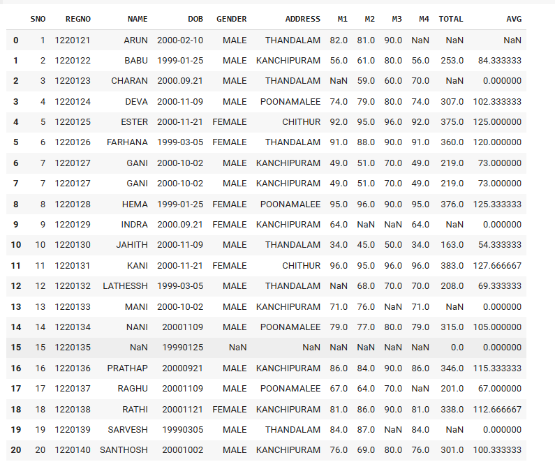 

   ```
   df.dropna(axis=0)
   ```
   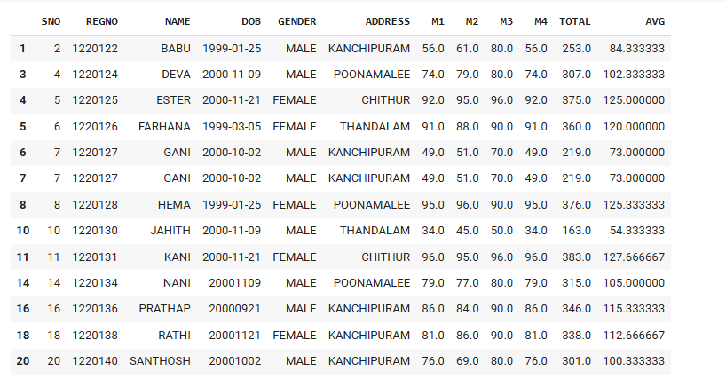

   ```
   df.dropna(axis=1)

   ```
   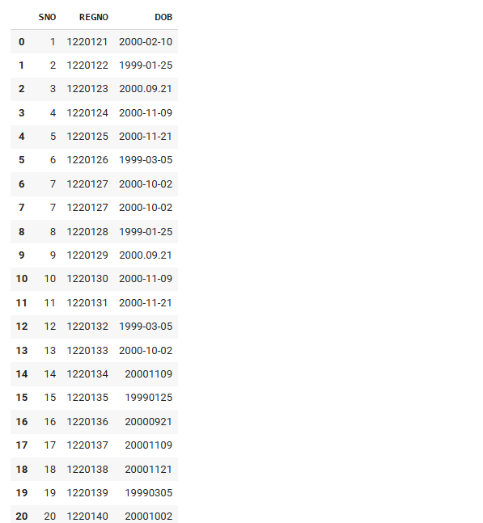

   ```
   df2=df[df['TOTAL']>270]
   df2
   ```
   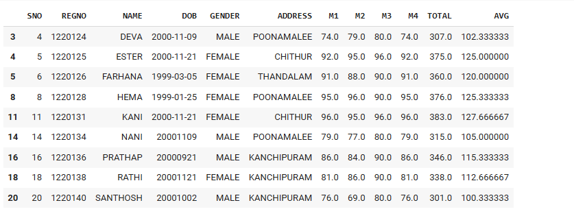

   ```
   df2=df[df['NAME'].str.startswith(('B','D'))& (df['TOTAL']>250)]
   df2
   df.iloc[:4]

   ```
   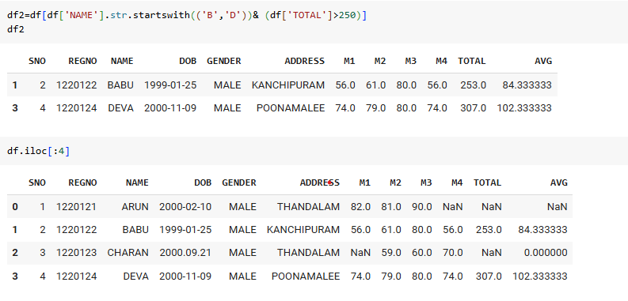

   ```
   df.iloc[0:4,1:4]
   df.iloc[[1,3,5],[1,3]]
   ```
   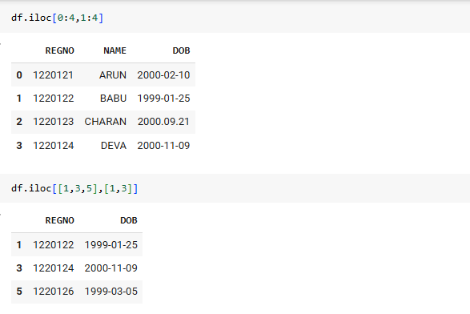

   ```
   dff=df.fillna(0)
   dff
   ```
   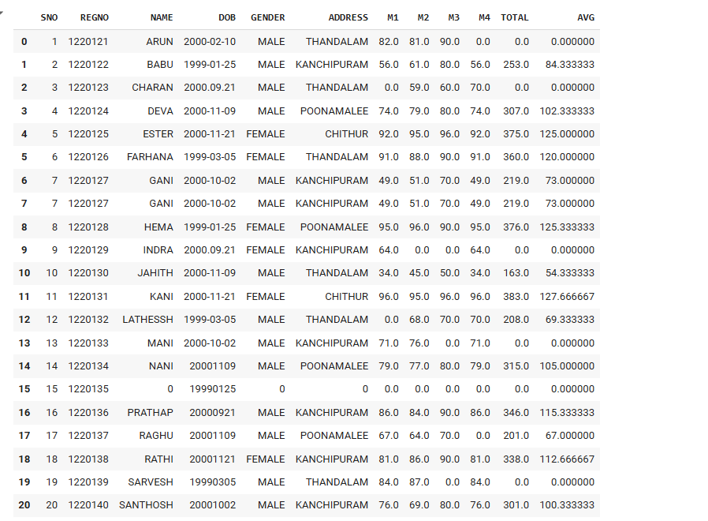

   ```
   df['TOTAL'].fillna(value=df['TOTAL'].mean())
   ```
   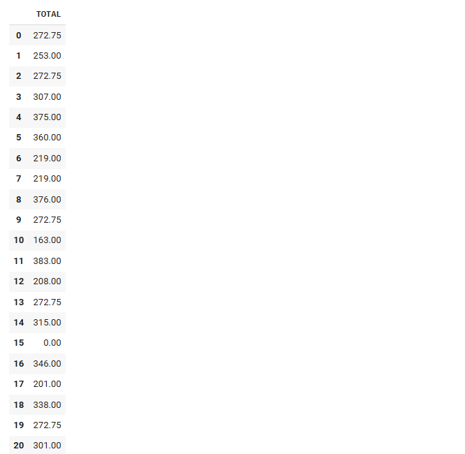

   ```
   df.fillna(method='ffill')
   ```
   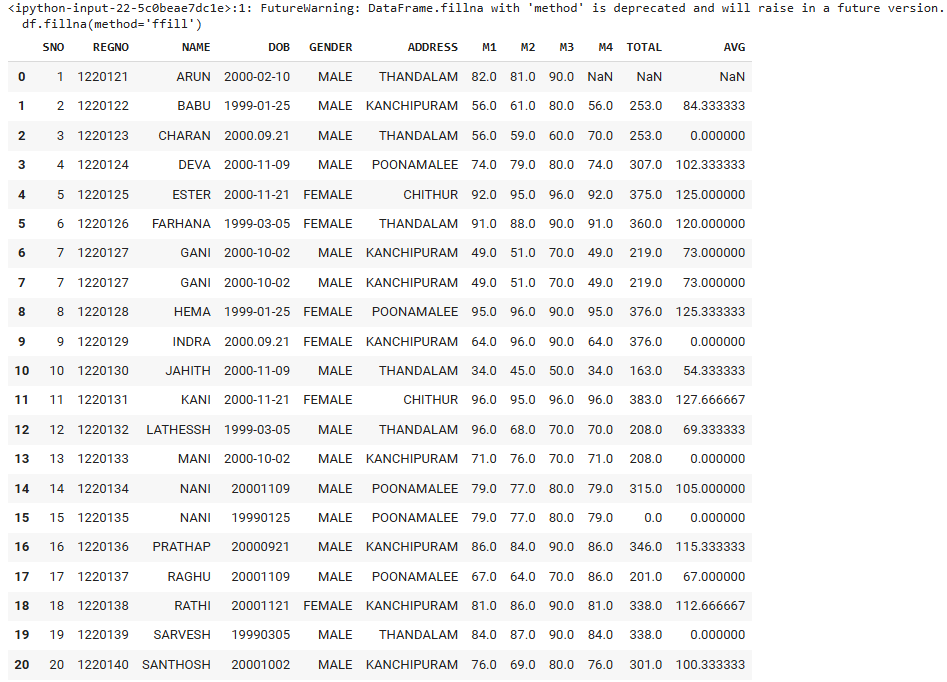

   ```
   df.fillna(method='bfill')
   ```
   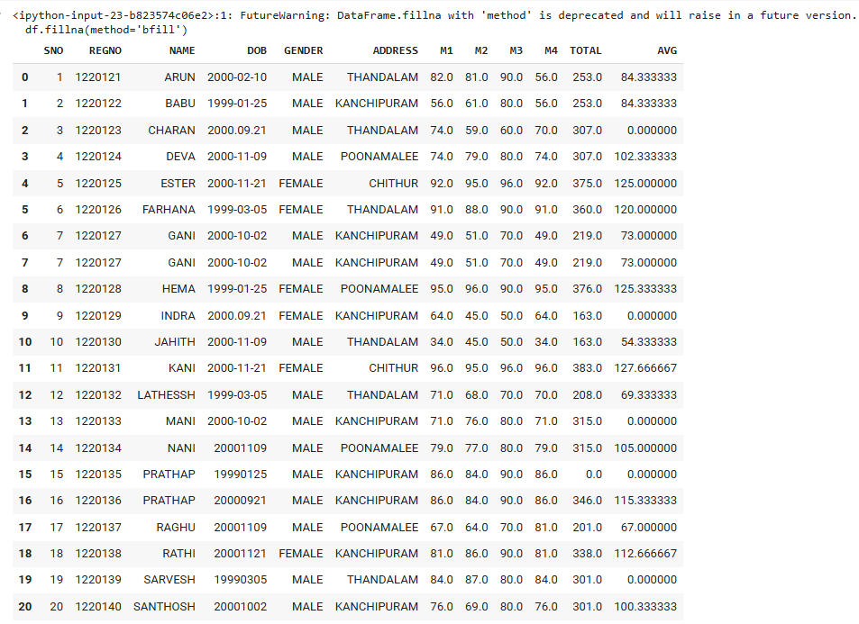

   ```
   df['TOTAL'].fillna(value=df['TOTAL'].mean(),inplace=True)
   df
   ```
   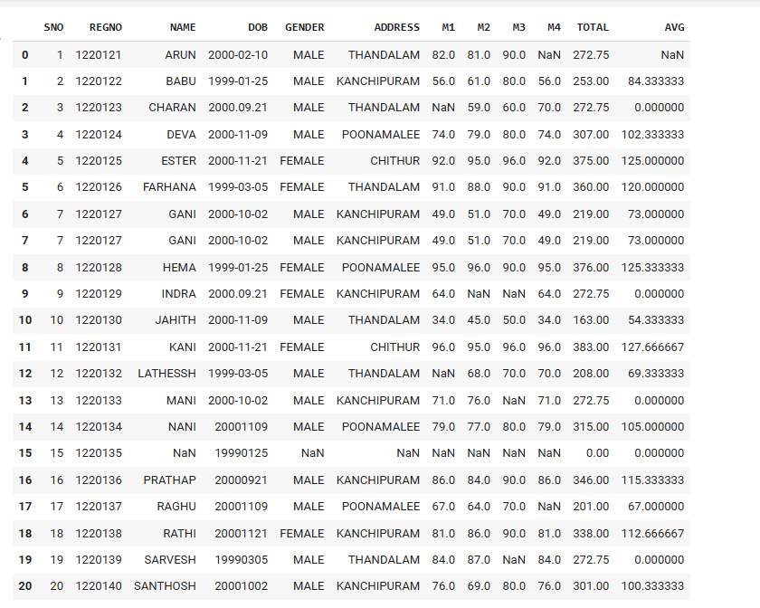

   ```
    import pandas as pd
    import seaborn as sns
    import numpy as np
    age=[1,3,28,27,25,92,30,39,40,50,26,24,29,94]
    af=pd.DataFrame(age)
    af
    age
    sns.boxplot(data=af)

   ```
   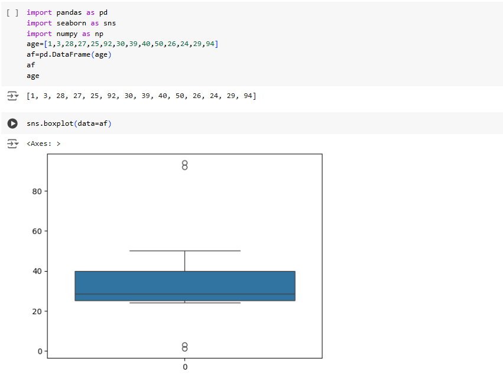

   ```
   sns.scatterplot(data=af)
   ```
   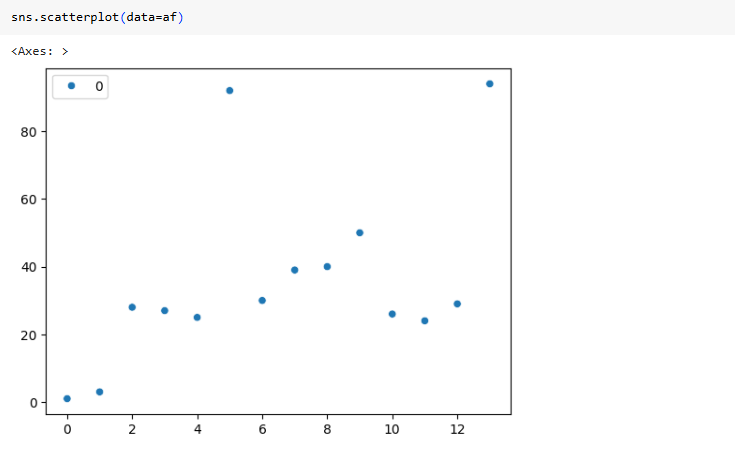
   ```
   q1=af.quantile(0.25)
    q2=af.quantile(0.5)
    q3=af.quantile(0.75)
    iqr=q3-q1
    iqr

    Q1=np.percentile(af,25)
    Q3=np.percentile(af,75)
    IQR=Q3-Q1
    IQR

    lower_bound=Q1-1.5*IQR
   upper_bound=Q3+1.5*IQR
   lower_bound

   upper_bound
   ```
   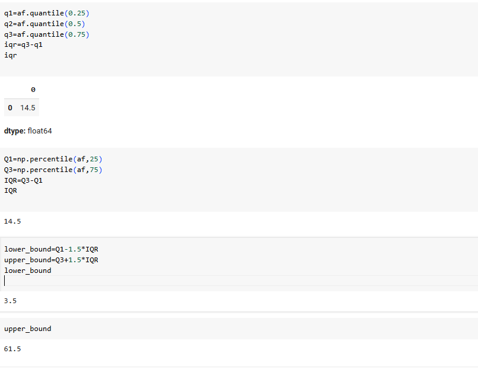

   ```
    outliers=[x for x in age if x < lower_bound or x > upper_bound]
    print("Q1 :",Q1)
    print("Q3 :",Q3)
    print("IQR :",IQR)
    print("lower_bound :",lower_bound)
    print("Upper_bound :",upper_bound)
    print("Outliers :",outliers)
   ```
   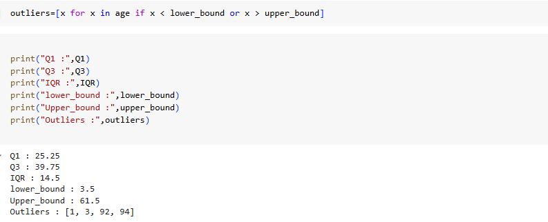

   ```
    import pandas as pd
    import seaborn as sns
    import numpy as np
    age=[1,3,28,27,25,92,30,39,40,50,26,24,29,94]
    af=pd.DataFrame(age)
    Q1=np.percentile(af,25)
    Q3=np.percentile(af,75)
    IQR=Q3-Q1
    lower_bound=Q1-1.5*IQR
    upper_bound=Q3+1.5*IQR
    af=af[((af>=lower_bound)&(af<=upper_bound))]
    af

   ```
   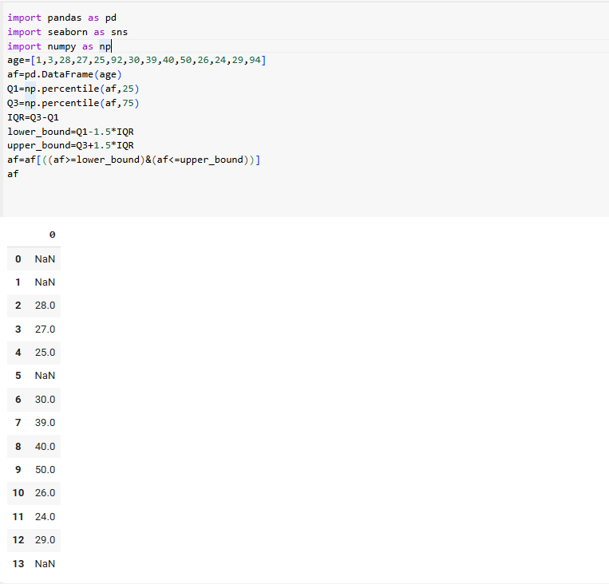

   ```
   data=[1,2,2,2,3,1,1,15,2,2,2,3,1,1,2]
    mean=np.mean(data)
    std=np.std(data)
    print('mean of the data is ',mean)
    print('std devietion is ',std)

    threshold=3
    outlier=[]
    for i in data:
    z=(i-mean)/std
    if z>threshold:
        outlier.append(i)
    print("outlier of dataset is",outlier)
   ```
   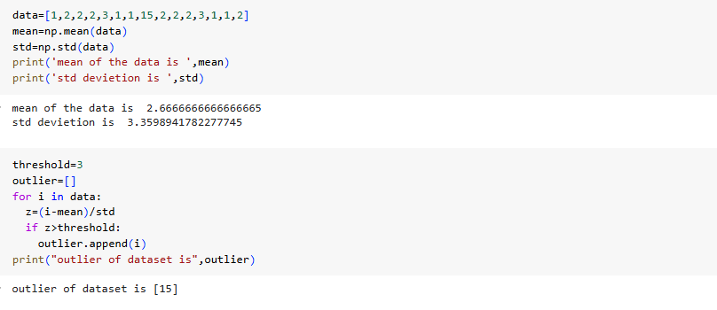
# Result
    Thus to read the given data and perform data cleaning and save the cleaned data to a file done successfully.
